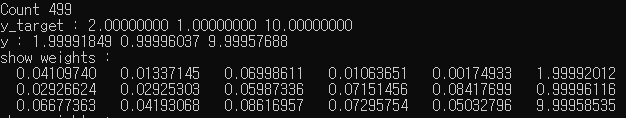

# MyFCNN1
C++ based FCNN(Fully Connected Neural Network) Simulator

## Build environment
* OS : Windows 10, macOS Sierra (10.12.6)
* Qt : Qt 5.14.2 MSVC2017 32bit, Qt 5.12.3 Clang 10.0

## How to test
<pre>
<code>
const int kNumInput = 5; const int kNumOutput = 3;
const int kNumHiddenLayers = 2;

const int kTrainingCount = 500;

const D kLearningRate = 0.02;

// Create Input Vector
VectorND<D> x(kNumInput);
x[0] = 0.0; x[1] = 1.5;
x[2] = 3.0; x[3] = 0.0;
x[4] = -10.0;

// Create Target Vector
VectorND<D> y_target(kNumOutput);
y_target[0] = 2.0;
y_target[1] = 1.0;
y_target[2] = 10.0;
</code>
</pre>
* Test this simulator by editing above codes
* Result

